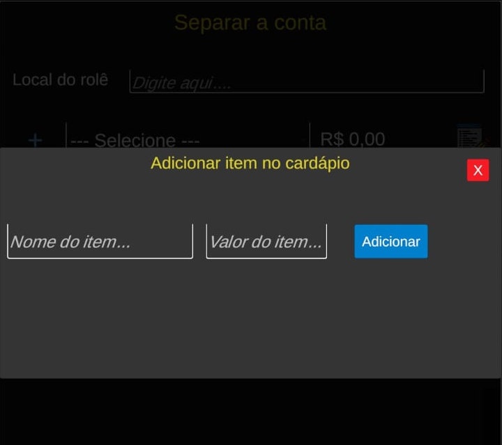
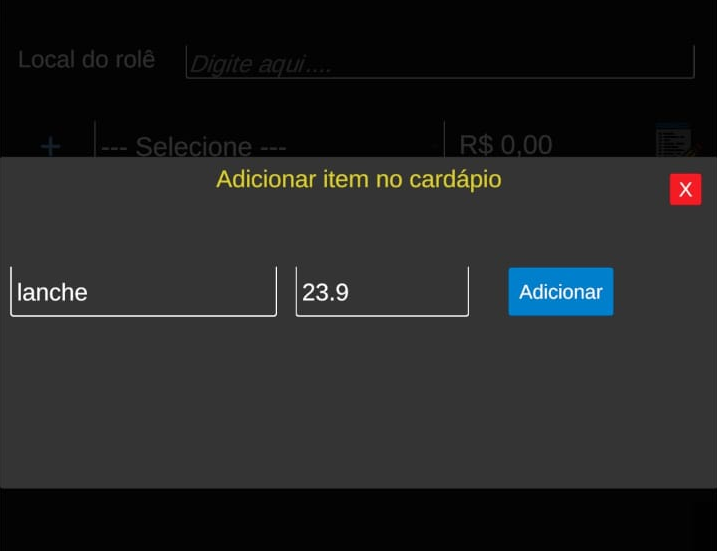
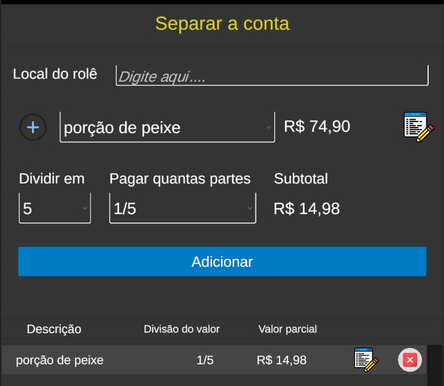
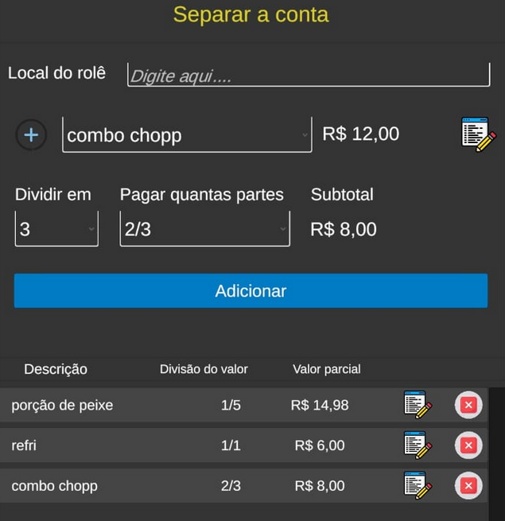
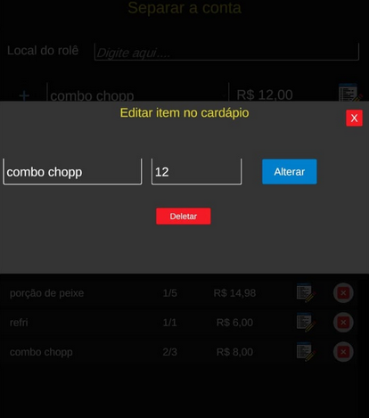

# Separar a conta

## O que é o app

Esse app foi desenvolvido primeiramente com intuito compartilhar o código no git para treinar o uso dessa ferramenta e para facilitar o *rolê* de quem gosta de sair com os amigos e dividir a conta. Nele você pode:

- Adicionar os itens pedidos pela galera e por você sozinho ou seu companheiro.
- Escolher em quantas partes o valor desse item será dividido e quantas partes você vai pagar.
- Editar essa divisão e partes pagas.
- Recuperar dados do último *rolê* anotado no app.

Foi um projeto que veio na cabeça depois de perceber que as vezes o final do *rolê* demora demais naquela história de dividir as contas para cada um, o que toma tempo do garçom, da fila no caixa  e que as vezes por falha na hora das contas acaba com o clima legal.

## Como compilar

Foi feito na Unity 2022 para Android, você pode baixar o código e fazer o build no Android Studio ou direto da própria Unity.

Vou deixar o .apk para quem tiver interesse de baixar e instalar no seu dispositivo.

Foi criado e compilado para Android versão **7.0 Nougat ou superior**, com API level 24.

## Atualizações

Logo mais trarei novidades de atualização, essa é apenas uma prévia.

- Recuperar dados do último *rolê* caso feche o aplicativo por engano.

- Histórico dos *rolês* contabilizados pelo app.

## Recursos

As imagens dos ícones forem retiradas do repositório:

https://www.flaticon.com/br/

## Imagens

